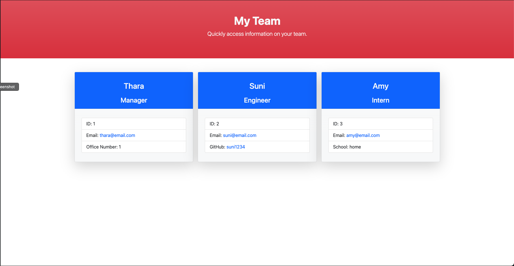

# team-profile-generator

## <h2 id="description"> Description </h2>

A command line app that generates a html file based on user inputs. A user will be prompted
with questions for information about their team members. Once answered, a html file will be generated that display information on each team member.

### Preview

The end product should resemble the mock-up provided below:

## <h2 id="table-of-contents"> Table of Contents </h2>

- [Description](#description)
- [Installation](#installation)
- [Usage](#usage)
- [Contribution Guidelines](#contribution)
- [Tests](#tests)
- [License](#license)

## <h2 id="installation"> Installation </h2>
[(Back to top)](#table-of-content)

To use this project, first clone the repo on your device using the commands below:

    git clone https://github.com/Supasiti/team-profile-generator.git

Then install all the required libraries by running the follow command

    npm i 

## <h2 id="usage"> Usage </h2>
[(Back to top)](#table-of-content)

To use this code on the direction, run

    node index.js

and follow all the prompts. The output file will be located in `/dist/` folder or alternatively you can run the following command:

    open /dist/index.html

Still confused? Follow a walkthrough [here](https://youtu.be/myQuzvY8_Qw).

## <h2 id="tests"> Tests </h2>
[(Back to top)](#table-of-content)

This project uses [Jest](https://jestjs.io) testing framework. This can be set up by running the following command:

    npm i --save-dev

Once the framework is downloaded, To test, run

    npm run test

Follow a video instruction [here](https://youtu.be/6sOVvqOrAGA);

## <h2 id="license"> License </h2>
[(Back to top)](#table-of-content)

Licensed under the [MIT](https://opensource.org/licenses/MIT) license.
